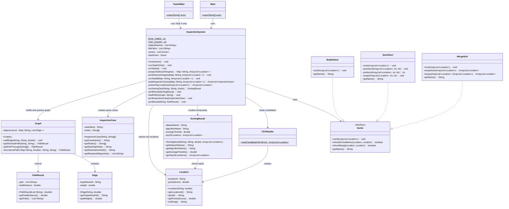

```mermaid
classDiagram
    class Main {
        +main(String[] args)$
    }

    class TaskAMain {
        +main(String[] args)$
    }

    class InspectionSystem {
        -RUN_TIMES : int$
        -TOP_COUNT : int$
        -datasetNames : List~String~
        -filePaths : List~String~
        -sorters : List~Sorter~
        -finalSorter : Sorter
        +runSystem() : void
        +runTaskAOnly() : void
        -runTaskA() : void
        -prepareSelectedTargets() : Map~String, ArrayList~Location~~
        -printSelectedTargets(Map~String, ArrayList~Location~~) : void
        -runTaskB(Map~String, ArrayList~Location~~) : void
        -buildInspectionCases(Map~String, ArrayList~Location~~) : ArrayList~InspectionCase~
        -extractTopLocations(ArrayList~Location~) : ArrayList~Location~
        -runSortingTest(String, String, Sorter) : SortingResult
        -printResult(SortingResult) : void
        -loadPaths(Graph, String) : void
        -printInspectionCase(InspectionCase) : void
        -printResult(String, PathResult) : void
    }

    class InspectionCase {
        -caseName : String
        -nodes : String[]
        +InspectionCase(String, String[])
        +getCaseName() : String
        +getNodes() : String[]
        +getStartingNode() : String
        +getDestinationNode() : String
        +getRequiredWaypoints() : List~String~
    }

    class CSVReader {
        +readCandidateFile(String) ArrayList~Location~$
    }

    class Location {
        -locationId : String
        -priorityScore : double
        +Location(String, double)
        +getLocationId() : String
        +getId() : String
        +getPriorityScore() : double
        +toString() : String
    }

    class SortingResult {
        -datasetName : String
        -algorithmName : String
        -averageTimeMs : double
        -top10Locations : ArrayList~Location~
        +SortingResult(String, String, double, ArrayList~Location~)
        +getDatasetName() : String
        +getAlgorithmName() : String
        +getAverageTimeMs() : double
        +getTop10Locations() : ArrayList~Location~
    }

    class Sorter {
        <<interface>>
        +sort(ArrayList~Location~) : void
        +shouldComeBefore(Location, Location) : boolean
        +shouldSwap(Location, Location) : boolean
        +getName() : String
    }

    class BubbleSort {
        +sort(ArrayList~Location~) : void
        +getName() : String
    }

    class QuickSort {
        +sort(ArrayList~Location~) : void
        -quickSort(ArrayList~Location~, int, int) : void
        -partition(ArrayList~Location~, int, int) : int
        -swap(ArrayList~Location~, int, int) : void
        +getName() : String
    }

    class MergeSort {
        +sort(ArrayList~Location~) : void
        -mergeSort(ArrayList~Location~) : ArrayList~Location~
        -merge(ArrayList~Location~, ArrayList~Location~) : ArrayList~Location~
        +getName() : String
    }

    class Graph {
        -adjacencyList : Map~String, List~Edge~~
        +Graph()
        +addEdge(String, String, double) : void
        +getShortestPath(String, String) : PathResult
        +getPathThrough(String[]) : PathResult
        -reconstructPath(Map~String, String~, Map~String, Double~, String, String) : PathResult
    }

    class Edge {
        -targetNodeId : String
        -weight : double
        +Edge(String, double)
        +getTargetNodeId() : String
        +getWeight() : double
    }

    class PathResult {
        -path : List~String~
        -totalDistance : double
        +PathResult(List~String~, double)
        +getTotalDistance() : double
        +getPath() : List~String~
    }

    Main --> InspectionSystem : runs
    TaskAMain --> InspectionSystem : runs Task A only

    InspectionSystem --> Sorter : uses
    InspectionSystem --> CSVReader : reads candidates
    InspectionSystem --> SortingResult : creates temporarily
    InspectionSystem --> Location : selects top locations
    InspectionSystem --> InspectionCase : creates query cases
    InspectionSystem --> Graph : builds and queries graph

    CSVReader --> Location : creates
    SortingResult --> Location : stores top10

    BubbleSort ..|> Sorter
    QuickSort ..|> Sorter
    MergeSort ..|> Sorter

    Graph --> Edge : contains
    Graph --> PathResult : returns
```
